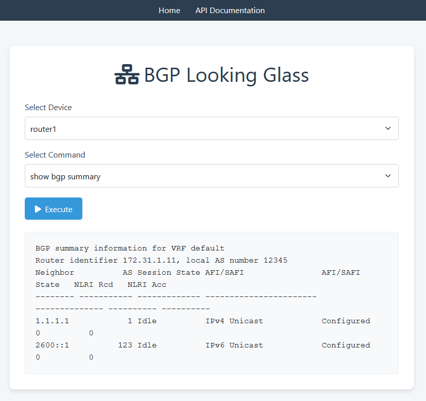

# BGP Looking Glass

A Flask-based web application for executing network commands on configured devices and retrieving raw output in JSON format. This tool provides a user-friendly interface and API for BGP and network diagnostics.

The application uses NAPALM to connect to the network devices so the app shoud support and devices NAPALM supports.  By default this app ships with most of the commands for someone would want for Arista devices but its very easy to add additional commands

## Prerequisites

- A Linux-based system (RHEL 8/9 or Ubuntu 20.04/22.04 or later)
- Python 3.8 or higher
- Git
- Nginx
- Access to a user with sudo privileges for initial setup

## Setup Instructions

This guide will walk you through setting up the BGP Looking Glass app as a non-root user named `bgplookingglass`, installing it in `/opt/bgplookingglass`, and configuring it to run as a systemd service with Nginx as a reverse proxy. Instructions are provided for both RHEL and Ubuntu systems.

### Step 1: Clone the repository
```bash
cd /opt
git clone https://github.com/jcoeder/bgplookingglass.git
```

### Step 2: Install dependencies and setup the environment
```bash
cd bgplookingglass
sudo ./setup.sh
```

### Step 3: Check to see if the app and nginx are running
```bash
sudo systemctl status nginx
sudo systemctl status bgplookingglass
```


